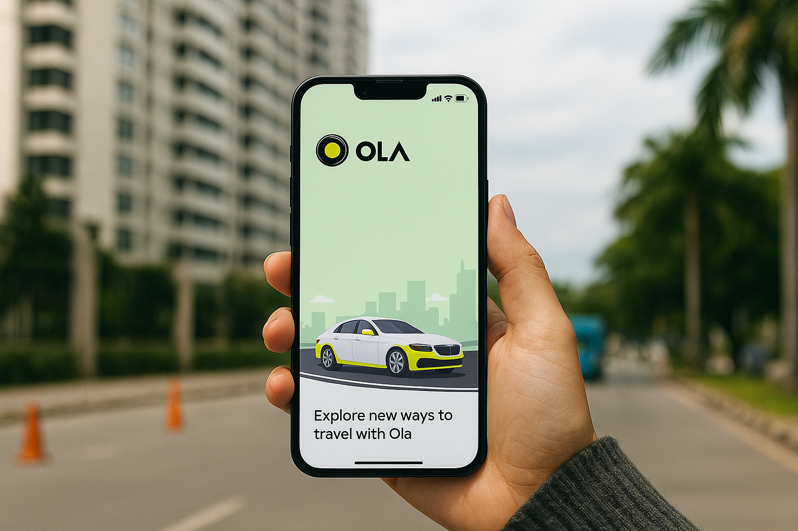

# 🚖 OLA Data Analysis Project  



## 📌 Project Overview  
This project analyzes **OLA ride booking data** for Bengaluru city. The dataset (1 month, 100k+ rows) was created for learning and demonstrates **end-to-end data analysis** using SQL, Power BI, and Excel.  

The aim was to:  
- Understand booking trends, cancellations, and customer behavior  
- Derive insights about vehicle types, ratings, and revenue  
- Build an interactive **Power BI dashboard** to visualize findings  
- Provide **recommendations** to improve business performance  

---

## 🛠️ Tools & Technologies  
- **SQL (PostgreSQL / PgAdmin4)** → Data Cleaning & Querying  
- **Power BI** → Dashboard & Visualization  
- **Excel (CSV)** → Raw data management  

---

## 🔍 Analysis Methodology  
1. **Data Cleaning & Modeling**  
   - Structured schema for bookings (date, time, booking_id, vehicle type, ratings, etc.)  
   - Ensured cancellation ratios:  
     - Customer cancellations ≤ 7%  
     - Driver cancellations ≤ 18%  
     - Incomplete rides < 6%  

2. **SQL Queries for Business Questions**  
   - Successful bookings, average ride distance, top customers, cancellation reasons, etc.  

3. **Power BI Dashboard**  
   - Interactive dashboards segmented into:  
     - **Overall Performance**  
     - **Vehicle Type Insights**  
     - **Revenue Analysis**  
     - **Cancellations**  
     - **Ratings (Driver vs Customer)**  

---

## ❓ Business Questions & SQL Answers  

| Question | SQL Query | Key Insights |
|----------|-----------|--------------|
| Retrieve all successful bookings | `SELECT * FROM bookings WHERE Booking_Status = 'Success';` | 62% of rides were successful |
| Avg. ride distance per vehicle type | `SELECT Vehicle_Type, AVG(Ride_Distance) FROM bookings GROUP BY Vehicle_Type;` | SUVs & Sedans had longest rides |
| Total cancelled rides by customers | `SELECT COUNT(*) FROM bookings WHERE Booking_Status = 'Cancelled by Customer';` | ~6% of rides |
| Top 5 customers by rides | Aggregated by `COUNT(Booking_ID)` | Heavy users identified |
| Cancelled rides due to driver personal issues | `WHERE Canceled_Rides_by_Driver = 'Personal & Car related issue';` | ~15% driver-side cancellations |
| Max & Min ratings for Prime Sedan | MAX/MIN query | Range: 2.1 ⭐ – 5 ⭐ |
| UPI payments for successful rides | `WHERE Payment_Method = 'UPI' AND Booking_Status='Success'` | UPI dominated digital payments |
| Avg. customer rating per vehicle | Aggregated by vehicle type | Sedans scored highest |
| Total successful booking value | SUM over successful rides | Highest revenue from weekends |
| Incomplete rides with reasons | `WHERE Incomplete_Rides='Yes'` | Mostly breakdowns or customer demand |

---

## 📊 Power BI Dashboard Highlights  
- **Ride Volume Over Time** → Spikes on weekends & match days  
- **Booking Status Breakdown** → Success vs. cancellation ratios  
- **Revenue by Payment Method** → UPI > Cash > Cards  
- **Top Customers & Vehicle Types** → SUVs & Sedans most profitable  
- **Cancellations** → Drivers cancelling > customers  
- **Customer vs. Driver Ratings** → Generally well-aligned, with outliers  

---

## ✅ Results & Outputs  
- Achieved **62% successful booking rate**  
- **Revenue** highest during weekends & cricket match days  
- **Top 5% customers** contributed nearly **20% of revenue**  
- **Prime Sedan & SUV rides** → Higher distance + higher revenue  
- **UPI** is the most preferred payment method  
- **Driver cancellations (15-18%)** are significantly higher than customer cancellations (~6%)  

---

## 💡 Suggestions & Takeaways  
1. **Reduce driver-side cancellations** by incentivizing drivers or improving assignment algorithms.  
2. **Target top customers** with loyalty programs (cashback/discounts).  
3. **Promote SUVs & Sedans** as premium high-revenue categories.  
4. **Leverage UPI dominance** by offering seamless integrations & discounts.  
5. **Focus on weekends/events** with surge pricing to maximize revenue.  

---

## 📂 Repository Structure  
```
📁 OLA-Data-Analysis
 ┣ 📊 Ola Dashboard.pbix          # Power BI Dashboard
 ┣ 📑 OLA-Data-Analyst-Project.pdf # Project Documentation
 ┣ 📑 Ola-Slidesuhub.pptx          # Presentation Slides
 ┣ 📜 sql.sql                      # SQL Queries
 ┣ 📂 data
 ┃ ┗ bookings_july.csv             # Sample Dataset
 ┣ 🖼 cover.png                     # Cover Image
 ┗ 📄 README.md                    # This File
```

---

## 🚀 How to Use  
1. Clone this repo:  
   ```bash
   git clone https://github.com/yourusername/OLA-Data-Analysis.git
   ```
2. Import `sql.sql` into PostgreSQL/pgAdmin4.  
3. Open `Ola Dashboard.pbix` in Power BI for visualizations.  
4. Explore queries & insights in the repo.  

---

## 👤 Author  
**Deepak Kumar**  
- 💼 Data Analyst | Marketing Executive | Freelancer  
- 🌐 [LinkedIn](#) | 📧 your.email@example.com  
